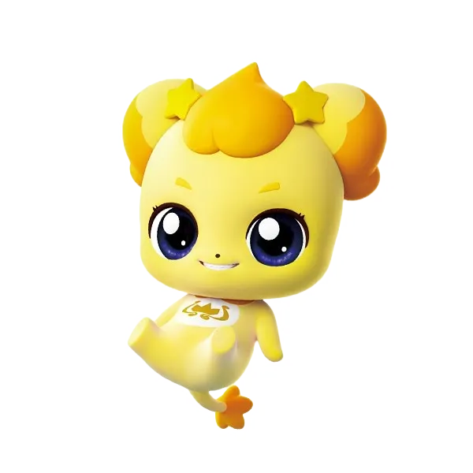

## NLPing Team

|[정준한](https://github.com/junhanjeong)|[이수진](https://github.com/owlemily)|[육지훈](https://github.com/jihunyuk)|[전진](https://github.com/jeenie2727)|[이금상](https://github.com/GeumSangLEE)|[허윤서](https://github.com/Yunseo-Lab)|
|:-:|:-:|:-:|:-:|:-:|:-:|
|<a href="https://github.com/junhanjeong"></a>|<a href="https://github.com/owlemily"></a>|<a href="https://github.com/jihunyuk"></a>|<a href="https://github.com/jeenie2727"></a>|<a href="https://github.com/GeumSangLEE"></a>|<a href="https://github.com/Yunseo-Lab"></a>|

## Members' Role
| Member | Role | 
| --- | --- |
| 정준한 | 과목 분류, 모듈화, 추론속도 향상 |
| 이수진 | EDA, 이상치 탐지, 과목별 모델성능 분석 |
| 육지훈 | EDA, 이상치 탐지, 모델 실험, choice 순서 변경, 제로샷 & 제로샷CoT 성능 분석 |
| 전진 | EDA, 데이터 라벨링 및 전처리, 데이터 증강, RAG 구현 |
| 이금상 | 외부데이터셋 탐색 |
| 허윤서 | 모델 성능 분석, 기타 utils 구현 |

### 랩업 리포트
- [Wrap-up report]((https://drive.google.com/file/d/1PZLglAX1ZvBIweqwlBdGpo-KxSwhREAd/view?usp=sharing))

### 0. 설치
```Bash
$ pip install -r requirements.txt
```

### 1. 사용법
1. config/base_config.yaml 파일을 수정합니다.
2. 사용할 config파일을 뒤에 붙여서 파일을 실행시킵니다. 
```Bash
$ python train.py --config_path config/config.yaml
$ python inference.py --config_path config/config.yaml
```
config.yaml은 default라서 아래와 같이 실행가능합니다.
```Bash
$ python train.py
$ python inference.py
```

### 2. 디렉토리 구조
```Bash
level2-nlp-generationfornlp-nlp-01-lv3
|-- README.md
|-- config
|   `-- config.yaml # 수정할 config 파일
|-- data
|   |-- cleaned_data.csv
|   |-- cleaned_data_utf8.csv
|   |-- output.csv
|   |-- test.csv
|   `-- train.csv
|-- inference.py
|-- models # 모델 저장 경로
|   `-- gemma
|       |-- checkpoint-2944
|       |   |-- README.md
|       |   |-- adapter_config.json
|       |   |-- adapter_model.safetensors
|       |   |-- special_tokens_map.json
|       |   |-- tokenizer.json
|       |   |-- tokenizer_config.json
|       |   |-- trainer_state.json
|       |   `-- training_args.bin
|       `-- checkpoint-4416
|           |-- README.md
|           |-- adapter_config.json
|           |-- adapter_model.safetensors
|           |-- special_tokens_map.json
|           |-- tokenizer.json
|           |-- tokenizer_config.json
|           |-- trainer_state.json
|           `-- training_args.bin
|-- modules # 실제 모든 모듈화 코드가 이곳에
|   |-- RAG
|   |   |-- add_data.py
|   |   |-- dense.py
|   |   |-- sparse.py
|   |   `-- llm_keyword.py
|   |-- data_preprocessing.py
|   |-- evaluation.py
|   |-- model_utils.py
|   |-- set_seed.py
|   `-- training_utils.py
|-- outputs # 추론 후 결과파일 경로
|   |-- output.csv
|   `-- output_org.csv
|-- requirements.txt
`-- train.py
```


### 4. config 설정법
```YAML
model:
  model_name_or_path: beomi/Llama-3-Open-Ko-8B # beomi/gemma-ko-2b # models/gemma/checkpoint-4416 #beomi/gemma-ko-2b
  load_in_8b: True # 추론할 때, 8b 양자화

data:
  train_csv: data/train.csv
  inference_csv: data/test.csv
  output_csv: outputs/output_llama.csv
  train_test_split_ratio: 0.1
  tokenize_max_length: 1024 # 아래 train.max_seq_length도 같이 바꿔주기

train:
  do_train: True
  do_eval: True
  lr_scheduler_type: cosine
  max_seq_length: 1024
  output_dir: models/llama
  per_device_train_batch_size: 1
  per_device_eval_batch_size: 1
  num_train_epochs: 3
  learning_rate: 2e-5
  weight_decay: 0.01
  logging_steps: 300
  save_strategy: epoch
  eval_strategy: epoch
  save_total_limit: 2
  save_only_model: True
  report_to: none

seed: 42

peft:
  r: 6
  lora_alpha: 8
  lora_dropout: 0.05
  target_modules: ['q_proj', 'k_proj']
  bias: none
  task_type: CAUSAL_LM

prompt:
  PROMPT_NO_QUESTION_PLUS: |
    지문:
    {paragraph}

    질문:
    {question}

    선택지:
    {choices}

    1, 2, 3, 4, 5 중에 하나를 정답으로 고르세요.
    정답:
    
  PROMPT_QUESTION_PLUS: |
    지문:
    {paragraph}

    질문:
    {question}

    <보기>:
    {question_plus}

    선택지:
    {choices}

    1, 2, 3, 4, 5 중에 하나를 정답으로 고르세요.
    정답:

  # tokenizer.chat_template에 쓸 설정. default 기입시 따로 설정을 안해주고 기존 tokenizer의 chat_template을 사용한다.
  tokenizer_chat_template: "{{ system_message }}{{ '<start_of_turn>user\n' + content + '<end_of_turn>\n<start_of_turn>model\n' }}{{ content + '<end_of_turn>\n' }}"
  # |
  #   
  #   
  #       
  #   

  #   
  #       {{ bos_token + system_message }}
  #   

  #   
  #       
  #           {{ '<|start_header_id|>user<|end_header_id|>\n\n' + message['content'] + '<|eot_id|>' + '<|start_header_id|>assistant<|end_header_id|>\n\n'}}
  #       
  #           {{ message['content'] + '<|eot_id|>' }}
  #       
  #   

  #   
  #       {{ '<|start_header_id|>assistant<|end_header_id|>\n\n' }}
  #   
  
  response_template: <start_of_turn>model # <|start_header_id|>assistant<|end_header_id|>\n\n # <start_of_turn>model
  
  # evaluation.py의 compute_metrics에서 정답 분리할 때 쓰는 compute_metrics_split
  compute_metrics_end_token: <end_of_turn> # <|eot_id|> # <end_of_turn>

  system_message: 지문을 읽고 질문의 답을 구하세요.
```
